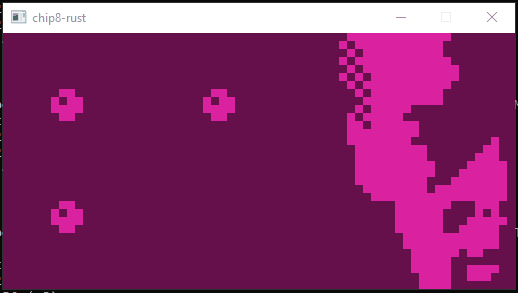
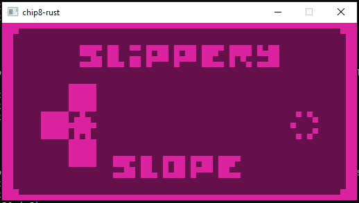

# chip8-rust
chip8-rust is a basic [CHIP-8](https://en.wikipedia.org/wiki/CHIP-8) interpreter in Rust.

[](https://www.revival-studios.com/other.php)
[](https://github.com/JohnEarnest/chip8Archive/tree/master/src/slipperyslope)

## Background
This project was created as an exercise in learning Rust. I had started work on a CHIP-8 interpreter in C# some months back, but lost interest. I figured that learning a new language would make things a bit more interesting, and I seem to have figured correctly!

I also ended up learning a bit about SDL2 and how emulators/interpreters work (although some [previous coursework](https://github.com/resistiv/YispSharp) certainly came in handy there, too).

## Building
chip8-rust relies on the [Rust-SDL2](https://crates.io/crates/sdl2) bindings crate, which requires you to have SDL2 installed to your system. The procedure is different per-platform, and I'd highly recommend you read the crate's documentation to get you set on the right track.

Once SDL2 is installed, the program can be built using:
```console
cargo build
```

## Usage
chip8-rust can be ran using a built executable like so:
```console
chip8-rust <ROM file path>
```
or via cargo:
```console
cargo run <ROM file path>
```

## Acknowledgements
I heavily referenced several resources while building this interpreter, namely:
* Matthew Mikolay's [Mastering CHIP-8](https://github.com/mattmikolay/chip-8/wiki/Mastering-CHIP%E2%80%908) (and related references)
* Tobias Langhoff's [Guide to making a CHIP-8 emulator](https://tobiasvl.github.io/blog/write-a-chip-8-emulator/)
* Austin Morlan's [Building a CHIP-8 Emulator [C++]](https://austinmorlan.com/posts/chip8_emulator/)

I also made use of Tim Franssen's [CHIP-8 test suite](https://github.com/Timendus/chip8-test-suite) while building up the functionality of the interpreter; this resource was invaluable and uncovered plenty of edge cases that I hadn't considered.

Finally, I referenced Austin Bricker's [An Introduction to Chip-8 Emulation using the Rust Programming Language](https://github.com/aquova/chip8-book) for the SDL2 interface code that drives the display and keyboard input.
